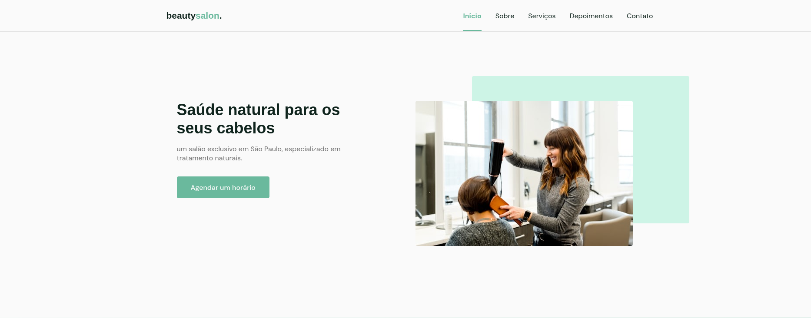

# 💇‍♀️ BeautySaloon



Página responsiva que simula a interface de um salão de beleza. Desenvolvido com HTML, CSS e JavaScript puro.

## 🖼️ Descrição

Este projeto é uma landing page de um salão de beleza, com foco em layout visual, responsividade e navegação simples.

## 🛠️ Tecnologias Utilizadas

- HTML5
- CSS3
- JavaScript (Vanilla JS)

## 🚀 Como executar o projeto

1. Clone o repositório:

```bash
git clone https://github.com/brunofelipehp/beautysaloon.git
```

2. Acesse a pasta do projeto:

```bash
cd beautysaloon
```

3. Abra o arquivo `index.html` no navegador (duplo clique ou usando Live Server no VS Code).

## 📁 Estrutura de Arquivos

```
beautysaloon/
├── index.html
├── style.css
├── script.js
└── assets/         
```

## 📄 Licença

Este projeto está sob a licença MIT. Veja o arquivo [LICENSE](LICENSE) para mais informações.

---

Desenvolvido com 💜 por [Bruno Felipe](https://github.com/brunofelipehp)
